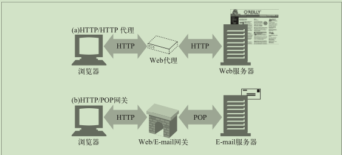

## 第6章 代理
### 6.1 web中间实体
web上代理服务器代表客户端完成事物处理的中间人。HTTP的代理服务器既是web服务器又是web客户端。HTTP 客户端会向代理发送请求报文，代理服务器必须像 Web 服务器一样，正确地处理请求和连接，然后返回响应。同时，代理自身要向服务器发送请求。   

#### 6.1.2 代理与网关的对比
严格来说，代理连接的是两个或多个使用相同协议的应用程序，而网关连接的则是
两个或多个使用不同协议的端点。

#### 6.3.1 代理服务器的部署
* 出口代理：可以将代理固定在本地网络的出口点，以便控制本地网络与大型因特网之间的流量。
* 入口代理：代理常被放在 ISP 访问点上，用以处理来自客户的聚合请求。
* 反向代理：代理通常会被部署在网络边缘，在 Web 服务器之前，作为替代物使用，在那里它们可以处理所有传送给 Web 服务器的请求，并只在必要时向 Web 服务器请求资源。
* 网络交换代理：可以将具有足够处理能力的代理放在网络之间的因特网对等交换点上，通过缓存来减轻因特网节点的拥塞，并对流量进行监视。
