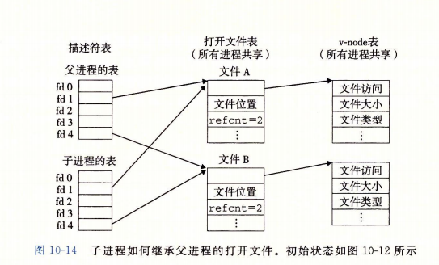

## 第 6 章  存储器层次结构
* 高速存储器是相对低速存储器的缓存：如下面前面存储器是后面存储器的缓冲区
```
寄存器（registry） <- 高速缓存寄存器 （cache memory） <- 主存存储器 （main memory） <- 磁盘 （disk） <- 网络上在其他机器上磁盘数据

（寄存器 - SRAM - DRAM - SSD - 磁盘 - 磁带）
```
这也意味着具有良好局部性（locality）的程序倾向于利用缓存更高速获取或者处理数据

### 6.1 存储技术
* 随机存储器有两类：他们都是断电易失（volatile）
```
SRAM (静态随机存储器) ：高速缓存寄存器
DRAM (动态随机存储器) ：主存存储器
```
* 磁盘：断电非易失也有两种一种为 旋转磁盘 另一种为 固态硬盘
旋转磁盘
```
扇区（512字节） -> 磁道 -> 盘面 -> 磁盘
```
扇区访问时间：寻道时间（seek time） + 旋转时间（rotational latency） + 传送时间（transfer time）  

固态硬盘（ssd）：
```
页（512字节） -> 块 -> 闪存
```
数据以页为单位写，但是一页只有在所属整个块被擦除后才能写（块磨损：100 000次重复写后不能使用）

### 6.2 局部性
程序局部性：倾向与引用邻近或者最近使用的数据项
  * 时间局部性：被引用过一次的内存位置不久将被多次引用
  * 空间局部性：被引用的位置附件的内存将被引用
顺序访问一个向量每一个元素，我们称为具有步长为1的引用模式。

### 6.3 存储层次结构
k层是k+1层的缓存数据，每一层存储器被划分为连续的数据块（称为块block），数据层之间以块大小为传送单元，相邻层之间块大小固定，但是其他的层次之间可以有不同块大小。层次越小块越小。
* 缓存命中：当程序需要k+1层数据如果在k层查询到，那么直接从k层去取。

### 6.4 高速缓存存储器
* 高速缓存的结构可以用元组（S, E, B, m）来描述

```
 S : 高速缓存组
 E : 高速缓存行
 B : 有效字节
 m : 每个存储器的位数 (t = m - (b + s))
```

## 第9章 虚拟内存

### 9.1 物理与虚拟寻址


### 9.2 地址空间
虚拟地址空间现代操作系统支持32或者64位。
主存中`每个字节（bit）`都有一个选自虚拟地址空间的虚拟地址和一个选自物理空间地址

### 9.3 虚拟内存作为缓存的工具
虚拟内存是磁盘缓存在主存的虚拟数组，在磁盘和主存的传输单元被分割成块，vm系统称这些块为`虚拟页`,物理内存称为`物理页`，他们的大小都等于2的n次方个字节P.

虚拟页集合分为三个不相交的子集：
* 未分配的：vm系统未分配的页，没有任何数据和他们相关联，不占用任何磁盘空间
* 缓存的： 被缓存在物理内存中已分配页
* 为缓存的：未缓存在物理内存中已分配页

操作系统为每个进程提供一个单独的页表，因而也就是一个独立的虚拟地址空间

页表（page table）：常驻内存中（一级页表），用于虚拟内存系统判断虚拟页是否缓存在DRAM中的某个地方
页表项（page table item : PTE）


### 9.4 虚拟内存作为内存管理的工具
* 简化连接： 独立的地址空间允许每个进程内存使用相同的基本格式。
* 简化加载：当加载可执行文件和共享文件时，将他们标记为无效（未缓存）那么CPU在指令引用时才真正的叫文件载入内存中（调入数据页）。
* 简化共享：将不同页表项映射到相同物理地址，最终实现不同进程间代码（只读）共享

### 9.5 虚拟内存作为内存保护的工具
* 每个PTE如 intel 64位机器中48位虚拟地址空间表示地址其余18位可以作为控制位作为内存的保护工具

### 9.6 地址翻译


!


## 第10章 系统级I/O
   输入/输出（I/O）是主存和外围设备（磁盘驱动器,终端,网络）之间复制数据的过程.

### 10.1 Unix I/O
一个Linux文件就是一个m字节的序列，而所有的I/O设备（网络，磁盘，终端）都被模型化为文件。
* `打开文件`，通过内核打开文件，内核返回一个非负整数（文件描述符），以后所有对此文件的操作都基于对这个文件描述符标识
* linux shell 为每个开始的进程创建三个文件，分别为标准输入（描述符为0）、标准输出（描述符1）、标准错误（描述符2）
* 对于一个打开的文件，内核记录一个k的文件位置表示这个文件下次打开默认的字节偏移量
* `读取文件`,从文件复制n>0个字节到内存，如果n+k大于文件本身大小m，这时会触发一个end-of-file（EOF）的条件，程序能检测到这个条件，在文件尾部没有明确的"EOF符号"。
* `关闭文件`，通知内核关闭这个文件，内核释放创建这个文件记录的数据结构。（只要一个进程终止了，内核默认关闭这个进程打开的所有文件）

### 10.2 文件
*  `普通文件(regular file)`包含任意数据.应用程序要区分文本文件（text file）和二进制文件 (binary file), 文本文件是含有ASCII或者Unicode字符的普通文件。对内核来说文本文件和二进制文件没有区别.(文本文件每行都以一个新行符"\\n"结束，数字值为0x0a)
* `目录(directory)`包含一组连接（link）的文件，每个连接都将一个文件名（filename）映射到一个文件，这个文件可能是另一个目录.
* `套接字(socket)`是与另一个进程进行网络通信的文件

### 10.3 打开和关闭文件
打开文件
```
int open(char *filname ,int flag, mode_t mode);
```
其中mode指定新文件访问权限，每一个进程都有一个umask，而这个文件权限就为`mode & ~umask`

关闭文件
```
int close(in fd);
```

### 10.4 读和写文件
```
//返回： 成功为读字节，若EOF则为0，粗错为-1
ssize_t read(int fd, void *buf, size_t n);

//返回：成功为写字节，出错为-1
ssize_t write(int fd, const void *buf, size_t n);
```
有时调用read和write返回字节小于参数n，原因有一下：
* 读取时遇到EOF
* 终端读取文本
* 读和写网络套接字

### 10.8 共享文件
* `描述符表(descriptor table)`. 每个进程都有独立的描述符表，每一项是进程打开的的文件描述符（用于索引文件表中的项）
* `文件表（reference count）`.打开文件的集合由一张文件表表示，由所有的进程共享，每一项内容包括文件位置、引用计数（指向当前表项的描述符数量），以及指向v-node表项的指针.
* `v-node表`. 由所有进程共享，表示具体文件的属性（stat结构中大多信息）

第一种文件共享：多个描述符通过不同文件表项引用相同文件。


第二种共享：子进程通过fork共享文件表项以及v-node


### 10.9 I/O重定向
I/O重定向实际上是描述符指向文件的修改，如：
```
// 复制oldfd描述符表项到newfd表项，覆盖newfd的内容，如果newfd已经打开dup2会在复制oldfd前关闭newfd.
int dup2(int oldfd, int newfd);
```
执行dup(4, 1);


### 10.10 标准I/O
libc提供了打开关闭文件等函数，这些被称为标准化I/O函数。这些函数都是对文件描述符和缓冲区的抽象.


