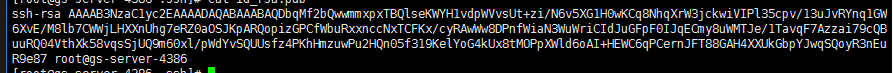
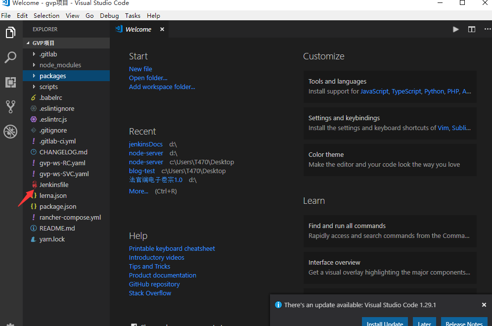

title: 0 安装和配置jenkins
date: 2020/5/15
categories:
- jenkins linux
---
## jenkins在linux的安装与配置（10.201.81.83）： 注意如果不想了解全部步骤可以直接跳到第七步
* 1 确认该机器已经安装jdk：jenkins是java开发的工业级cicd工具
  * java -version, 注意：有些版本的jenkins不能使用1.6的jdk

* 2 在线安装
  * sudo wget -O /etc/yum.repos.d/jenkins.repo http://jenkins-ci.org/redhat/jenkins.repo  
  * sudo rpm --import http://pkg.jenkins-ci.org/redhat/jenkins-ci.org.key 
  * sudo yum install jenkins
  * sudo service jenkins start
  * sudo service jenkins status

<!--more-->  

* 3 修改端口配置：因为jenkins的默认端口为8080，这个端口在服务器大多数都被占用，这里改为8089(可以为其他没有占用的端口)
  * sudo vim /etc/sysconfig/jenkins //修改JENKINS_PORT="8089"
  * sudo service jenkins restart // 重启服务更新配置
  
* 4 修改jenkins在linux中的角色：jenkine默认角色为jenkins，在linux中权限比较严格，这里设置为root比较方便如后来配置git的免密就比较方便了
  * sudo vim /etc/sysconfig/jenkins //修改JENKINS_USER="root"
  * sudo service jenkins restart // 重启服务更新配置

* 5 jenkins初始化
  * 进入 http://10.201.81.83:8098/ 根据提示初始化密码，以及安装一些默认的插件。完后遇到一个空白页。
  * 进入http://10.201.81.83:8098/restart，点击页面上的重启jenkins，进入登录界面

* 6 jenkins与git的ssh免密配置：一般jenkins需要从git自动拉取代码需要提前加上免密机制，下面的流程需要这个配置（有兴趣的可以googel下ssh）
  * 一般linux中有git(如果没有自行安装),找到git安装的路径并且配置在jenkins中这样jenkins就可以使用git命令，默认git安装路径为/usr/libexec/git-core/git
  * jenkins-> 系统管理 -> 全局工具配置 -> 下图 -> 保存
  

  * sudo su :进入服务器切换为root用户 (上面第步4中jenkins角色配置为root，这里免密就是使用root用户)

  * cd ~/.ssh : 进入根目录的.ssh文件夹(如果不存在这个文件夹或者文件夹里面没有东西证明root用户没有加ssh，可以使用ssh-keygen -t rsa 生成)

  * cat id_rsa.pub ： 将输出的公钥复制（下图）
  
  
  * 将复制公钥添加到git用户的ssh中：userLogo -> Settings -> SSH Keys -> Key -> add Keysc(这样配置后jenkins中git的权限就是当前你配置gitlab用户所拥有的权限，如拉取某个项目的权限)
   

  
  * 以管理员身份进入jinkins网站(http://10.201.81.83:8098/):这里必须为管理员不然无法添加凭证

  * 凭证 -> 系统 -> 添加域 —> 填写域名（这里随便填写）
  

  * 添加凭证
    

  * 复制linux中root用户的私钥 (和前面一样 sudo cd ~/.ssh  cat id_rsa)
   
  
  * 将刚刚复制的私钥填写到图中对应位置：注意选择类型的时候选择ssh
    

* 7 jenkin 流程构建：这个步骤是大部分人jenkins用户都要关注的部分，其他上面6个步骤只要jenkin管理员关注，或者想自己搭建一个自己jenkin的同学可以了解
  * 首先通过一个账户登录到jenkins网站
  

  * New任务 -> 选择流水线
   

  * 配置流水线
  
    * 1：这里主要关注Pipeline,其他都是可选项
    * 2： 选择Definition，这里我们选择Pipeline script from SCM意思就是利用项目中的Jenkinfile来执行cicd。
    * 3： 选择拉取代码的方式，这里选择git
    * 4： 填写产库地址,注意这里填写仓库地址的形式是亦git@开头的也就是以ssh协议连接的，当然如果想要每次填写用户名和密码也可以是使用http协议
    * 5： 填写Credentials，这里是上面第6部添加凭证后才有的结果，如果上面添加凭证的用户没有这个仓库的权限，这里会报错
    * 6：这里指定cicd执行执行的分支，换句话说这个分支上必须要有Jenkins相关配置文件，在我们这里这个文件就指的是下面的Jenkinsfile
    * 7:这里就是配置Jenkinsfile的路径和文件名了，这里的话只填写了Jenkinsfile，所以cicd的脚本都在项目顶级目录的Jenkinsfile。如果你不想你的cicd命令放在顶级目录这里就可以做修改
    * 8:最后保存

* 8 使用jenkins执行cicd
   * 在项目相应的目录添加相应的cicd脚本文件，在第7部我们指定了在项目的顶级目录的Jenkinfile文件写cicd脚本文件 （如何写脚本在下一篇文章中有）
     
   * 通过用户名和密码登录到http://10.201.81.83:8098/，进入相应的项目中，点击立即构建就会执行项目中Jenkinfile文件中的脚本 (其实触发jenkins触发的方式由很多种，这里是采用手动触发)
     
   