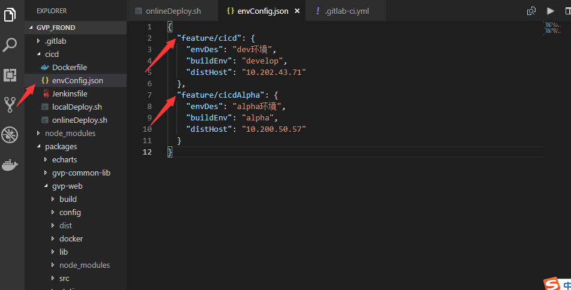
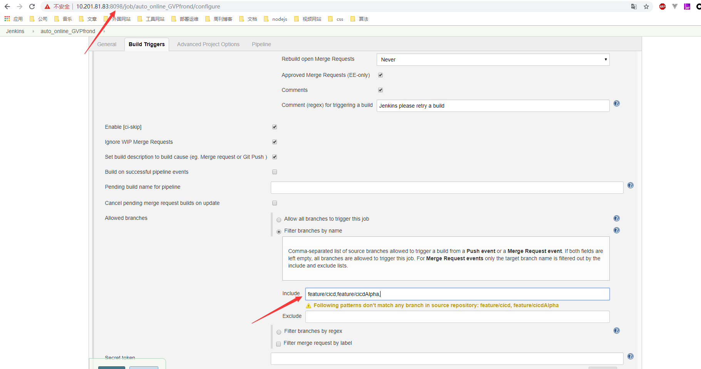
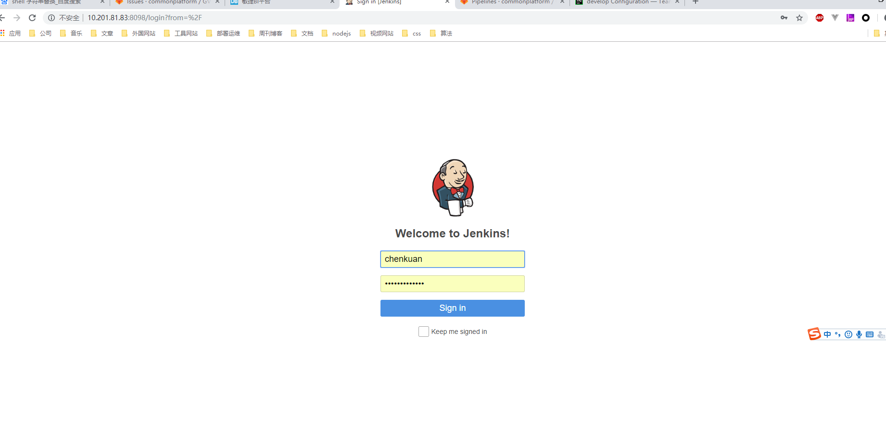
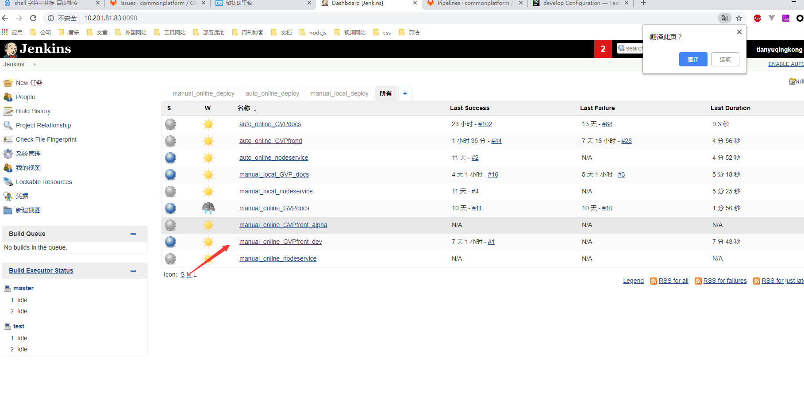
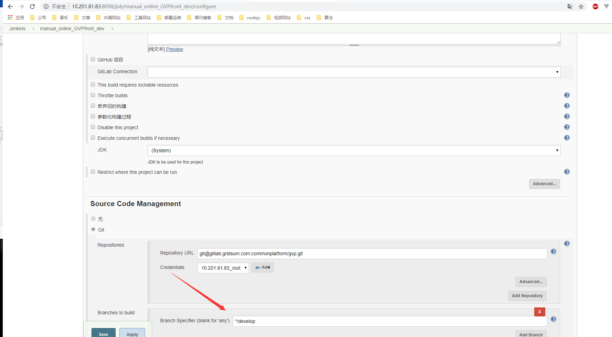
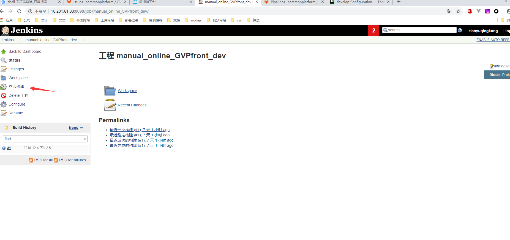

title: 3 jenkins多环境多项目发布简明
date: 2020/5/19
categories:
- jenkins
---
## GVP_frond_web例子

### （1）自动发布：代码推送到特定分支后自动发布一个环境

<!--more-->
* 当代码推送到特定指定分支后，web前端项目将会自动进行线上某个指定环境的发布 
* 上面说的指定内容都是在项目顶级目录的cicd文件下进行配置的，具体是cicd/envConfig.json里面

在上面文件中有两个分支分别是feature/cicd以及feature/cicdAlpha他们分别对应着两个不同环境dev和alpha，当任何代码向这两个分支推送时两个环境就会发生自动部署。  

*  上面的两个分支其实还需要在jenkins进行配置以便这两个分支发生变化，进而触发jinkins流程

### (2)手动发布：登录到jenkins网站后手动一键发布
* 首先登录到jenkins网站 账号： chenkuan  密码：wearetheone11  

* 找到想发布项目点击进入，下图找到的是web前端的dev环境   

* 点击左边Configure确认是自己想要发布的分支，或者修改配置分支  

* 确认后回到上级页面点击立即构建按钮,进行一键自动发布

### （3）总结：核心理念是一个分支对应着一个环境，并且这些分支是可以配置的

