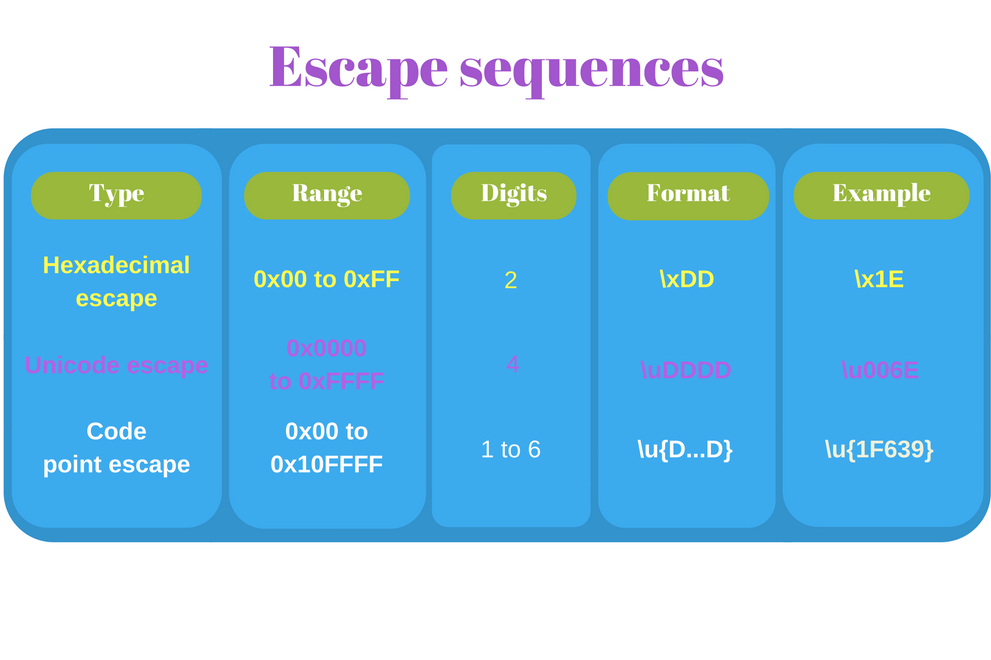

title: unicode
date: 2017/11/24
categories:
- 编码
---

## Unicode的作用
  Unicode是一个世界通用的字符集，它定义了全世界大部分书写体系的字符集，并为每一个字符分配了一个独一无二的数字（代码点）。
<!--more-->
## Unicode基本概念

### 字符（characters）与代码点(code points)
    * Unicode中的字符是一个抽象概念。每一个抽象字符都有一个对应的名称，例如LATIN SMALL LETTER A。该抽象字符的图像表现形式（glyph）是a。
    * 代码点是指被分配给某个抽象字符的数字：代码点以U+<hex>的形式表示，U+是代表Unicode的前缀，而<hex>是一个16进制数。例如U+0041和U+2603都是代码点。代码点的取值范围是从U+0000到U+10FFFF。
    note： 并非所有的代码点都有对应的抽象字符，可用的代码点有1114112个，但分配了抽象字符的只有128237个。


### Unicode平面
平面是指从U+n0000到U+nFFFF的区间，每个区间相隔65536(0x10000),其中的n可以从0x0取到0x10

    * 平面0包含从U+0000到U+FFFF的代码点
    * 平面1包含从U+10000到U+1FFFF的代码点
    * 平面16包含从U+100000到U+10FFFF的代码点


平面0比较特殊，被称为基本多文种平面或简称BMP。它包含了大多数现代语言的字符 (基本拉丁字母, 西里尔字母, 希腊字母等)和大量的符号  

    *  e对应代码点U+0065 抽象字符名： LATIN SMALL LETTER E
    *  |对应代码点U+007C 抽象字符名： VERTICAL BAR
    *  ■对应代码点U+25A0 抽象字符名： BLACK SQUARE
    *  ☂对应代码点U+2602 抽象字符名： UMBRELLA

BMP之后的16个平面（平面1，平面2，…，平面16）被称为星光平面或辅助平面。星光平面的代码点被称为星光代码点。这些代码点的取值范围是从U+10000到U+10FFFF。

### 码元(code units)   
码元是指使用某种给定的编码规则给字符编码后得到的比特序列。

字符编码将抽象层面的码点转换为物理层面的比特序列：码元。

常用的字符编码有UTF-8, UTF-16 和 UTF-32.

大多数JavaScript引擎使用UTF-16编码字符。它会影响JavaScript处理Unicode的方式。  
*  BMP中的码点编码为单个16位的码元
*  星光平面的码点编码为两个16位的码元
BMP中的代码点刚好能存进一个16位的码元。编码BMP可谓小菜一碟。

### 代理对(surrogate pairs)
存储一个星光代码点（属于星光平面）： GRINNING FACE character 。该字符对应的代码点是 U+1F600。UTF-16需要两个码元来编码，每个16比特。代码点 U+1F600 被拆分为所谓的代理对：0xD83D（高位代理码元）与 0xDE00（低位代理码元）。
```
console.log('\uD83D\uDE00');
```
代理对与码点之间互相转换的算法如下所示:
```
function getSurrogatePair(astralCodePoint) {  
  let highSurrogate = 
     Math.floor((astralCodePoint - 0x10000) / 0x400) + 0xD800;
  let lowSurrogate = (astralCodePoint - 0x10000) % 0x400 + 0xDC00;
  return [highSurrogate, lowSurrogate];
}
getSurrogatePair(0x1F600); // => [0xDC00, 0xDFFF]

function getAstralCodePoint(highSurrogate, lowSurrogate) {  
  return (highSurrogate - 0xD800) * 0x400 
      + lowSurrogate - 0xDC00 + 0x10000;
}
getAstralCodePoint(0xD83D, 0xDE00); // => 0x1F600
```

### 组合用字符(combining marks)
字素就是用户所认为的一个字符。屏幕上所展示的一个有形的字素称为图像字符（glyph）。

在大多数情况下，一个Unicode字符就代表一个字素。例如 U+0066 LATIN SMALL LETTER F就是一个英文字母f。

但有时候一个字素会包含一系列字符。

例如å在丹麦语书写系统中是一个不可再分的字素。但它是用U+0061 LATIN SMALL LETTER A (渲染为a) 结合一个特殊字符U+030A COMBINING RING ABOVE（渲染为◌̊）来显示的。

U+030A用来修饰前一个字符，这种字符称为组合用字符。
```
console.log('\u0061\u030A'); // => 'å'  
console.log('\u0061');       // => 'a'
```
在用户看来一个组合字符序列（基础字符+组合用字符）是"一"个符号（例如'\u0061\u030A'就是'å'）。但开发者必须清楚实际上要用到两个代码点U+0061和U+030A来生成å。


## javascript 中的Unicode

一般源码的存储和交换通常使用UTF-8(web通常编码形式),string类型(字符串)是由16比特无符号整数值("元素")组成的集合，每个在字符串的元素被当做UTF-16码元，而字符串的长度就是码元的个数。
```
let smile = '\uD83D\uDE00';  
console.log(smile);        // => '😀'  
console.log(smile.length); // => 2

let letter = 'e\u0301';  
console.log(letter);        // => 'é'  
console.log(letter.length); // => 2  
```
始终将JavaScript中的字符串视为一串码元序列。字符串渲染的结果并不能清晰地表明它包含了怎样的码元。

大多数JavaScript字符串方法都不能 智能识别Unicode 。如果字符串含有混合的Unicode字符，在调用myString.slice()、myString.substring()等方法时就要小心了。

### 转义序列
在js字符串中转义序列通常是将码点转为码元，一共有三种方式

 #### 16进制转义序列(Hexadecimal escape sequence)：\x<hex>. \x为前缀，后面跟一个2位的16进制数
```
var str = '\x4A\x61vaScript';  
console.log(str);                    // => 'JavaScript'  
var reg = /\x4A\x61va.*/;  
console.log(reg.test('JavaScript')); // => true 
```
6进制转义序列只能编码从U+00到U+FF的有限数量的代码点，因为它只能有2位数字。但16进制转义序列的好处是它很短。

#### Unicode转义序列(Unicode escape sequence)：你想转义整个BMP中的代码点，转义形式是\u<hex>,\u为前缀，后面跟一个4位的16进制数。
```
var str = 'I\u0020learn \u0055nicode';  
console.log(str);                 // => 'I learn Unicode'  
var reg = /\u0055ni.*/;  
console.log(reg.test('Unicode')); // => true
```
想要在JavaScript文本中表示星光字符，可以用两个连续的Unicode转义序列（高位代理与低位代理），生成代理对：
````
var str = 'My face \uD83D\uDE00';  
console.log(str); // => 'My face 😀'  
````

#### 码点转义序列(Code point escape sequence)： ECMAScript 2015提供了能够表示整个Unicode空间：从U+0000到U+10FFFF，也就是BMP与星光平面的转义序列。\u{<hex>}，<hex>是一个长度为1至6位的16进制数。 
```
var str = 'Funny cat \u{1F639}';  
console.log(str);                      // => 'Funny cat 😹'  
var reg = /\u{1F639}/u;  
console.log(reg.test('Funny cat 😹')); // => true  
```


### 字符串比较
JavaScript中的字符串是码元的序列。因此字符串的比较可以看作是码元的计算与匹配。
```
var firstStr = 'hello';  
var secondStr = '\u0068ell\u006F';  
console.log(firstStr === secondStr); // => true
```

假设你想比较两个渲染结果相同，但包含不同码元序列的字符串。因为看上去相同的字符串经过比较却不相等.
```
var str1 = 'ça va bien';  
var str2 = 'c\u0327a va bien';  
console.log(str1);          // => 'ça va bien'  
console.log(str2);          // => 'ça va bien'  
console.log(str1 === str2); // => false
```
str1和str2渲染结果看起来相同，但包含不同的码元。

因为字素ç可以通过两种方法生成：
* 使用U+00E7 LATIN SMALL LETTER C WITH CEDILLA
* 或者用组合字符序列：U+0063 LATIN SMALL LETTER C 加上组合用字符U+0327 COMBINING CEDILLA.

### 标准化：标准化是指将字符串转换为统一的表示形式，以保证具有标准等价性（或兼容等价性）的字符串只有一种表示形式。

在JavaScript中对字符串进行标准化需要调用ES2015提供的myString.normalize([normForm])方法。
```
var str1 = 'ça va bien';  
var str2 = 'c\u0327a va bien';  
console.log(str1 === str2.normalize()); // => true  
console.log(str1 === str2);             // => false
```
'ç'与'c\u0327'具有标准等价性。
调用str2.normalize()，会返回一个str2 的标准形式副本（'c\u0327'替换为'ç'）。因此比较语句str1 === str2.normalize()会如预期一般返回true.
但为了使操作符两端都取得标准化字符串，将待比较的2个字符串都标准化也是合理的。

### 字符串长度
```
var str = 'cat\u{1F639}';  
console.log(str);        // => 'cat😹'  
console.log(str.length); // => 5  
```
然而smile.length等于5，因为U+1F639是一个星光代码点，它被编码成了2个码元（一个代理对）。
ECMAScript 2015引入了一种能够识别星光字符的算法。星光字符即使被编译为2个码元，也会被计算为一个字符。
这个能够识别Unicode的利器就是字符迭代器String.prototype[@@iterator]()。你可以给字符串加上扩展操作符[...str]或Array.from(str)函数（两者都会调用字符串迭代器）。然后再计算返回数组中的字符个数。
```
var str = 'cat\u{1F639}';  
console.log(str);             // => 'cat?'  
console.log([...str]);        // => ['c', 'a', 't', '?']  
console.log([...str].length); // => 4
```
那么组合字符序列呢？由于每个组合用字符都是一个码元，因此你会遇到同样的困难。
```
var drink = 'cafe\u0327\u0301';  
console.log(drink);                    // => 'cafȩ́'  
console.log(drink.length);             // => 6  
console.log(drink.normalize());        // => 'cafȩ́'  
console.log(drink.normalize().length); // => 5
```
于是我们很难过地发现drink.normalize().length的值为5，仍然不能正确地计算字符的个数。

### 字符定位
由于字符串是码元的序列，通过字符串索引来访问字符同样会有困难。
```
var omega = '\u{1D6C0} is omega';  
console.log(omega);        // => '𝛀 is omega'  
console.log(omega[0]);     // => '' (unprintable symbol)  
console.log(omega[1]);     // => '' (unprintable symbol)  
```

想要正确地访问字符串中星光字符，有2种方法：
* 使用能够识别Unicode的字符串迭代器生成一个字符数组[...str][index]
* 用number = myString.codePointAt(index)获取代码点，然后用String.fromCodePoint(number)将代码点转换为字符（推荐方法）

```
var omega = '\u{1D6C0} is omega';  
console.log(omega);                        // => '𝛀 is omega'  
// Option 1
console.log([...omega][0]);                // => '𝛀'  
// Option 2
var number = omega.codePointAt(0);  
console.log(number.toString(16));          // => '1d6c0'  
console.log(String.fromCodePoint(number)); // => '𝛀'  
```
函数omega.codePointAt(0)能够识别Unicode，因此它返回了字符串omega第一个字符的星光代码点数字0x1D6C0。函数String.fromCodePoint(number)则返回了这个代码点对应的字符：'𝛀'.

字符定位在遇到组合用字符时会出现和上面一样的问题。
```
var drink = 'cafe\u0301';  
console.log(drink.normalize());        // => 'café'  
console.log(drink.normalize().length); // => 4  
console.log(drink.normalize()[3]);     // => 'é'
```

### 正则匹配
正则表达式与字符串一样，是基于码元工作的。因此与上文描述的情形相似，使用正则表达式在处理代理对和组合字符序列时也会遇到困难。
```
var smile = '😀';  
var regex = /^.$/;  
console.log(regex.test(smile)); // => false  
```
smile包含星光字符U+1F600 GRINNING FACE。U+1F600被编码为一个代理对0xD83D 0xDE00。

然而正则表达式/^.$/期望的是1个码元，于是正则匹配regexp.test(smile)失败了。

在定义字符区间的时候情况会更糟。JavaScript直接报错了：
```
var regex = /[😀-😎]/;  
// => SyntaxError: Invalid regular expression: /[😀-😎]/: 
// Range out of order in character class
```
星光代码点会被编码为代理对，因此JavaScript会用码元/[\uD83D\uDE00-\uD83D\uDE0E]/来表示这个正则表达式。而在pattern中每个码元被视为一个单独的元素，所以正则表达式会忽略代理对这个概念。

好在ECMAScript 2015引入了u标志，使得正则表达式能够识别Unicode。这个标志让我们能够正确处理星光字符。

在正则表达式中可以使用Unicode转义序列/u{1F600}/u。这样比写高位代理和低位代理/\uD83D\uDE00/要短。
```
var smile = '😀';  
var regex = /^.$/u;  
console.log(regex.test(smile)); // => true  
```

```
var smile = '😀';  
var regex = /[😀-😎]/u;  
var regexEscape = /[\u{1F600}-\u{1F60E}]/u;  
var regexSpEscape = /[\uD83D\uDE00-\uD83D\uDE0E]/u;  
console.log(regex.test(smile));         // => true  
console.log(regexEscape.test(smile));   // => true  
console.log(regexSpEscape.test(smile)); // => true  
```

## 结语
也许在JavaScript中有关Unicode的最重要的概念就是将字符串视为码元序列，事实也确实如此。

如果开发者认为字符串是由字素（或字符）组成，忽略码元序列这个概念，就会感到困惑。