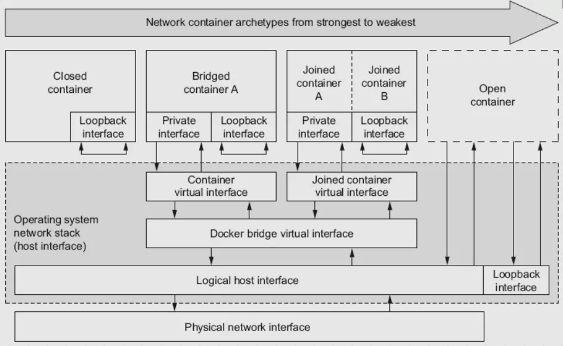

title: docker网络
date: 2020/3/13
categories:
- docker network
---

## docker 
Docker的网络环境隔离使用的是Linux Namespace技术进行网络隔离的，每一个 network namespace都有一个独立的网络环境其中包括：网卡,路由，iptable规则等。  
 整体架构如下图：
 

 ### 1.1 docker四种网络模式
隔离性由强到弱如下:  
* none模式 指定方式：--net=none
* bridge模式 指定方式：--net=bridge
* container模式 指定方式：--net=container:NAME_or_ID
* host模式 指定方式：--net=host
```
# 默认创建好三种模式，无法删除
docker network ls 
NETWORK ID          NAME                DRIVER              SCOPE
99646193e5fd        bridge              bridge              local
213621f7ea56        host                host                local
7bbc7a38b19f        none                null                local
```

### 1.2 bridge 网桥模式
docker引擎在创建时会，创建一个docker0的虚拟网桥，在同一台宿主机上启动的docker容器的网络设备（虚拟网卡）默认会连接到这个网桥上，并且默认地址为172.17.0.0/16中的地址。网桥工作的方式类似与物理交换机（bridge有多个端口，数据可以从任何端口进来，进来之后从哪个口出去和物理交换机的原理差不多，要看mac地址）

从docker0子网中分配一个IP给容器使用，并设置docker0的IP地址为容器的默认网关。在主机上创建一对虚拟网卡veth pair设备，Docker将veth pair设备的一端放在新创建的容器中，并命名为eth0（容器的网卡），另一端放在主机中，以vethxxx这样类似的名字命名，并将这个网络设备加入到docker0网桥中。可以通过brctl show命令查看。


 