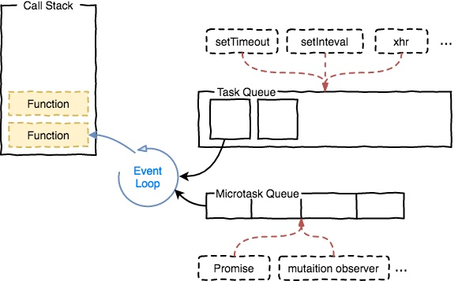
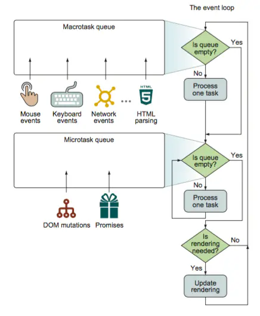

本文主要是基于浏览器标准(html5)介绍macrotask和microtask. 由于事件循环和执行环境相关所以在node中执行结果稍有不同。  

`首先了解我们知道js的特性是单线程、非阻塞I/O，不用考虑并发,死锁等问题。但是js的执行会导致多个线程同时在跑，如我们同时触发了异步http请求线程,以及定时器线程，如何管理他们之间的关系就需要even-loop。`

1：首先我们的js线程在调用栈中触发了各种异步线程  
2：异步线程执行完毕后放到异步任务对应源的队列中（Queue）  
3：最后由event-loop将队列中（Queue）需要执行的任务按照一定策略取到js调用栈中执行



接下来就是[event-loop的执行的一些细节(html标准)](https://html.spec.whatwg.org/multipage/webappapis.html#event-loop-processing-model)，大概分三步

1: 执行最旧的task（一次）  
2：检查是否存在microtask，然后不停执行，直到清空队列（有可能多次）  
3：检测是否执行render，如果可以就执行


* 一个线程中，事件循环(event-loop)是唯一的，但是根据任务源(tasks source)做区分的任务队列(tasks queued)可以拥有多个。

* 任务队列又分为macrostask(宏任务)与microtask(微任务)，在最新标准中，它们被分别称为task与jobs。

* macrotask大概包括：script(整体代码), setTimeout, setInterval, setImmediate, I/O, UI rendering, networking(如ajax，fetch)。

* microtasks大概包括: process.nextTick, Promise, Object.observe(已废弃), MutationObserver(html5新特性)

* 在每个macrotask(宏任务)也就是task执行之间浏览器也许会更新渲染：原因是60fps（60 frame per second），这意味着约16.7ms进行一次render,如果task间隔没超过这个时间也就不会更新。

* 在执行macrotask(宏任务)的时候遇到一个新的macrotasks(宏任务)会将任务分发到对应队列中等待下一次事件循环执行

* mircrotask在两种情况会执行  
 1在回调函数中函数栈没有正在执行中的其他js
 2在每个task的后面

* 处理 microtask 队列期间，新添加的 microtask 添加到队列的末尾并且也被执行

* 来自不同任务源的任务会进入到不同的任务队列。其中setTimeout与setInterval是同源的。

* 在每一次事件循环(event-loop)中，macrotask 只会提取一个执行，而 microtask 会一直提取，直到 microtask 队列清空。

```
console.log('glob1');
setTimeout(function() {
      setTimeout(function(){
		console.log('test1');
		Promise.resolve().then(function(){
            console.log('test1_promise')
        });
	});
    console.log('timeout1');
    new Promise(function(resolve) {
        console.log('timeout1_promise');
        resolve();
    }).then(function() {
        console.log('timeout1_then')
    });
})

new Promise(function(resolve) {
    console.log('glob1_promise');
    resolve();
    console.log('glob2_promise');
}).then(function() {
    console.log('glob1_then')
}).then(function(){
	Promise.resolve().then(function(){
		console.log('glob1_then_test')
	});
});

// glob1
// glob1_promise
// glob2_promise
// glob1_then
// glob1_then_test
// timeout1
// timeout1_promise
// timeout1_then
// test1
// test1_promise
```
分析下上面执行的结果：
1： golb1 第一个task（js script）中执行的同步console  
2： glob1_promise 第一个task（js script）中执行promise构造函数的同步console
3： glob2_promise 第一个task（js script）中执行promise构造函数的同步console
4:  glob1_then 第一个task执行完毕后检测先microtask队列中有一个Promise
5： glob1_then_test 第4步Promise执行过程中插入的microtask，也会继续执行
6： timeout1 执行第二个task（setTimeout）里面的同步console
7： timeout1_promise 第二个task中执行Promose构造函数的console
8： timeout1_then 第二个task执行完毕后检测microtask队列中有一个Promise
9： test1 第三个task（setTimeout）中同步执行的console
10： test1_promise 第三个task执行完毕后检测microtask队列中的Promise