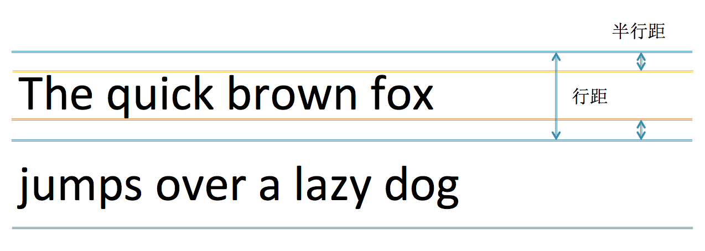
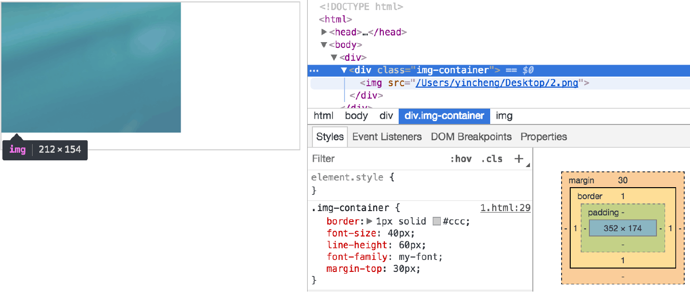

title: font-size with line-height
date: 2017/10/9
categories:
- css
---

## 1.字号与行高
  字号大小就是字体的高度，如字号为50px,那么他的高度如下图：  
  

  行距为行高减去字号大小，如下图：

所以 半行距 = (lineHeight-fontSize) / 2; 
<!--more-->

## 2.字体设计 
  正常的字体都要如下图的刻度和度量线：

  这其中的值一般如下，也可以自己设置

  Units Per Em表示一个字的高度有1000个单位，baseline的坐标为0，其它线的坐标相对于baseline，如下图所示：

## 3.图片底部的空白
  设置div的font-size为40px，line-height为60px，底部有一点空白：

  在画上辅助线后就清楚许多了：

  底部的空白高度 = (baseline - descender) + 半行距；  
  基线到底线的距离为：
  250 / 1000 * 40 = 10px   
  半行距为：
  (60 - 40) / 2 = 10px
  空白距离：
  10px + 10px = 20px
  如何将这个空白去掉，可以将div的行高设置为0就可以。
