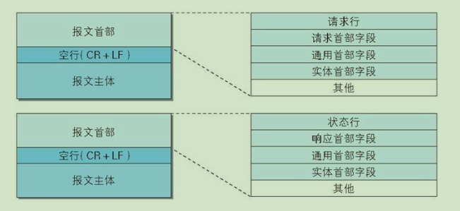
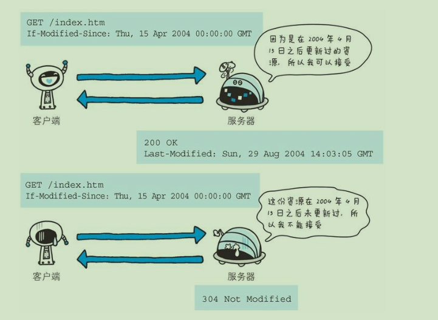
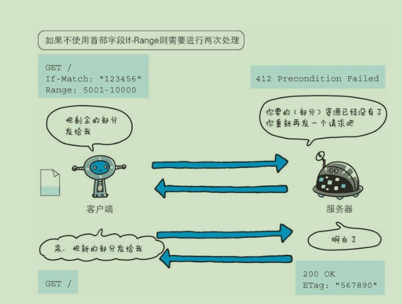

## 第3章 HTTP报文内的HTTP信息
一般报文和响应报文的解构如下图所示：  



<!--more-->

#### 报文和实体的差异
* 报文(message): HTTP通信的基本单位，由8位组字节流组成，通过HTTP通信传输  
* 实体(entity):作为报文的一部分，被当做请求和响应的有效载荷数据被传输，其内容由实体首部和实体主体组成。


## 第4章 返回结构的HTTP状态码
状态码类别：  
 状态                   | 类别         | 原因
----                    |------         |----
 1XX Informatinal       | 信息性状态码   | 接收的请求处理中 
 2XX Success            | 成功状态码     | 请求正常处理完毕
 3XX Redirection        | 重定向状态码   | 需要进行附加操作以完成请求
 4XX Client Error       | 客服端错误状态码| 服务器无法处理请求
 5XX Server Error       | 服务器错误状态码| 服务器处理请求错误

常用状态码：
* 200 OK    表示从客户端发来的请求在服务器端正常处理了
* 204 No Content   表示服务器接受请求已成功处理，但是返回的响应保温中不含实体的主体部分。
* 206 Partail Content 表示客户点进行范围请求，服务器成功执行这部分的GET请求。响应报文中的Content-Range 指定实体内容的范围。
* 301 Moved Permanently   表示资源已经永久性重新分配URI，这是应该按照响应头的Location首部字段的URI重定向。
* 302 Found 表示资源暂时重新分配URI
* 303 See Other 表示资源存在另一个URI，应该使用GET方法定向获取请求的资源。
* 304 Not Modified 表示客户端发送附带条件(If-Match,If-Modified-Since,If-None-Match,If-Range,If-Unmodified-Since)请求时，服务器端允许请求访问资源，但是为满足条件，返回不包含任何相应主体部分。
* 400 Bad Request 表示报文中存在语法错误。
* 401 Unauthorized 表示未授权，或授权验证失败
* 403 Forbidden 拒绝访问
* 404 Not Found 无法通过指定的URI找到对应的资源
* 500 Internal Server Error 服务器执行时发生错误。
* 503 Service Unavailable 服务器暂时超负荷或停机维护中，最好写入在响应头中写入RetryAfter首部字段给客户端

## 第5章 与HTTP协作的web服务器

#### 5.2.1 代理
代理：接受客户端发送的请求并转发给服务器，同时也接收服务器返回的响应并转发给客户端。
一般具体过程如下：  


按照使用分类。一种是否使用缓存，另一种是否修改报文。
* 缓存代理： 代理转发响应时，缓存代理(Caching Proxy)会预先将资源副本保存在代理服务器上，当代理再次接收到相同资源请求时，就不可以从源服务器获取资源，而是将之前缓存作为响应返回。
* 透明代理： 转发请求或响应时，不对报文做任何加工称为透明代理。

#### 5.2.2 网关
网关：利用网关可以由HTTP请求转化为其他协议通信。  


#### 5.2.3 隧道
隧道： 按照要求建立器与其他服务器通信的路线，如利用SSL等加密手段。隧道的目的在保障客户端与服务器进行安全通信。

### 5.3 缓存
缓存分为客户端缓存和代理缓存。


## 第6章 HTTP首部
根据首部字段实际用途被分为以下4中类型
* 通用首部字段(General Header Fileds): 请求报文和响应报文都会使用的首部。
* 请求首部字段(Request Header Fileds): 客户端项服务器端请求使用的首部。 补充了请求附加内容，客户端信息，响应内容相关优先级等信息。
* 响应首部字段(Response Header Fields): 服务器向客户福安响应时使用的首部。补充了响应附加内容，也会要求客户端附加额外内容信息。
* 实体首部字段(Entity Header Fields): 请求报文和响应报文实体部分使用的首部。补充资源内容更新时间等与实体有关的信息。 

HTTP/1.1 规范定义如下47中首部字段
通用首部子段：  
  

请求首部子段：    
  

响应首部子段：  
  

实体首部子段：  
  

除了RFC2616中定义的47种首部子段。还有Cookie, Set-Cookie和Content-Disposition等。

####  6.3.2 Connection
* 控制代理不再转发给源服务器的首部字段  Connection: 不再转发的首部字段名

#### 6.3.3 Date
* 创建HTTP报文的日期和时间 Date:Fri, 20 Oct 2017 06:33:42 GMT

#### 6.3.4 Pragma
* HTTP/1.1 遗留字段，虽然为通用首部字段，但是只在客户端发送请求时使用。 为了保证全部中间服务器行为保存一般都会含以下两个字段
```
Cache-Control: no-catch
Paragma: no-cache
```

#### Tralier
* 允许发生方在分块发送消息后面添加额外的元信息 Trailer: header-names

#### Transfer-Encoding
* Transfer-Encoding 是一个逐跳传输消息首部，即仅应用于两个节点之间的消息传递，而不是所请求的资源本身。

## 6.4 请求首部

#### Accept
* Accept 首部字段可通知服务器，用户代理能够处理的媒体类型及媒体类型的相对优先级，使用q来表示权重(0-1)默认为1.
```
Accept:text/html,application/xhtml+xml,application/xml;q=0.9,image/webp,image/apng,*/*;q=0.8
```
#### Accept-Charset
* Accept-Charset 首部字段可用来通知服务器用户代理支持的字符集及字符集的相对优先顺序.
```
Accept-Charset: iso-8859-5, unicode-1-1;q=0.8
```

#### Accept-Encoding 
* Accept-Encoding 首部字段用来告知服务器用户代理支持的内容编码及内容编码的优先级顺序
```
Accept-Encoding:gzip, deflate, br
```

#### Accept-Languag
* Accept-Language 用来告知服务器用户代理能够处理的自然语言集（指中文或英文等），以及自然语言集的相对优先级。
```
Accept-Language:zh-CN,zh;q=0.8
```

#### Authorization
;

#### Host
* 首部字段 Host 会告知服务器，请求的资源所处的互联网主机名和端口号Host 首部字段在 HTTP/1.1 规范内是唯一一个必须被包含在请求内的首部字段  


#### If-Match
* 如If-xxx这种首部字段称为条件请求，只有服务器接受附加条件后判定为真才会执行请求。 需要注意的是所有的条件都同时满足时才会处理请求。If-Match字段必须和ETag匹配时，服务器才会接受请求。


#### If-Modified-Since


#### If-None-Match
* 在 GET 或 HEAD 方法中使用首部字段 If-None-Match 可获取最新的资源。因此，这与使用首部字段 If-Modified-Since 时有些类似。  


#### If-Range
* 它告知服务器若指定的 If-Range 字段值（ETag 值或者时间但是二者不能同时使用）和请求资源的 ETag 值或时间相一致时，则作为范围请求处理。反之，则返回全体资源。


* 若不使用If-Range请求失败则需要两次请求


#### If-Unmodified-Since
* 的作用的是告知服务器，指定的请求资源只有在字段值内指定的日期时间之后，未发生更新的情况下，才能处理请求。  

#### Referer
* 首部字段 Referer 会告知服务器请求的原始资源的 URI。原始资源的 URI 中的查询字符串可能有 ID 和密码等保密信息，要是写进 Referer 转发给其他服务器，则有可能导致保密信息的泄露。

## 6.5 响应首部字段

#### Accept-Ranges
* Accept-Ranges 是用来告知客户端服务器是否能处理范围请求，以指定获取服务器端某个部分的资源。一种时bytes能处理一种为none不能处理

#### age
* 首部字段 Age 能告知客户端，源服务器在多久前创建了响应。字段值的单位为秒。

#### ETag
* 首部字段 ETag 能告知客户端实体标识。它是一种可将资源以字符串形式做唯一性标识的方式。
```
//强 ETag 值 不论实体发生多么细微的变化都会改变其值
ETag: "usagi-1234"

//弱 ETag 值 弱 ETag 值只用于提示资源是否相同会在字段值最开始处附加 W/。
ETag: W/"usagi-1234"
```

#### Location
* 该字段会配合 3xx ：Redirection 的响应，提供重定向的
URI。

#### Proxy-Authenticate
* 首部字段 Proxy-Authenticate 会把由代理服务器所要求的认证信息发送给客户端

#### Retry-After
* 首部字段 Retry-After 告知客户端应该在多久之后再次发送请求。主要配合状态码 503 Service Unavailable 响应，或 3xx Redirect 响应一起使用。

#### Vary
* 从代理服务器接收到源服务器返回包含 Vary 指定项的响应之后，若再要进行缓存，仅对请求中含有相同 Vary 指定首部字段的请求返回缓存。即使对相同资源发起请求，但由于 Vary 指定的首部字段不相同，因此必须要从源服务器重新获取资源。


## 6.6 实体首部字段


