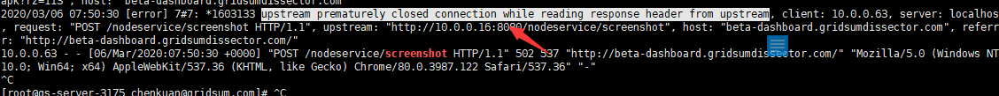
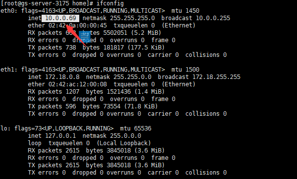
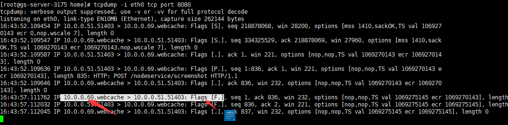

## 环境
生产环境的一个nodejs接口突然报错了，这个接口（http:xxxx/api/nodeservice/screenshot）是一个返回当前页面截图的接口，报错表象为这个接口请求1-2分钟左右后报502 Bad Gateway错误。并且其他环境无法复现。


<!--more-->

## 排错
 * (1) 直接去生产环境查看nodejs日志发现这个截图除了时间慢了点还是会正常产生截图，并没有错误日志。
 * (2) 转变排查方向直接到代理nodejs接口的nginx，这个nginx和nodejs都以`docker container`的形式部署在同一台服务器上，并且nginx的日志都重定向到容器的标准输出上,在宿主机上使用下面命令：
```
# $(docker ps | awk '/nginx/{print $1}') 这行命令开启一个shell子进程返回出nginx的container ID
docker logs -f  $(docker ps | awk '/nginx/{print $1}') | grep screenshot

```

图中有用错误信息为`upstream prematurely closed connection while reading response header from upstream`字面意思为`当从上游读取响应标头时，上游过早关闭连接`，检查了nginx的各种配置都没问题。那是不是就如日志提示一样是上游的nodejs出了问题。
* (3) 转到nodejs容器来抓包分析，在linux上一般使用`tcpdump`进行抓包但是nodejs容器里没有安装`tcpdump`，并且`tcpdump`不能直接在宿主机上直接抓取容器内的包，因为docker的network使用了[namespace的隔离](https://lwn.net/Articles/531114/)，两个环境的网络进行了隔离，还好有个nsenter工具可以根据容器的PID进入到容器network namespace
```
# $(docker ps | awk '/nodeservice/{print $1}') 和上面一样开启一个shell子进程获取nodeservice（nodejs容器名字）的容器ID 
# $(docker inspect --format "{{.State.Pid}}" $containerID) 开启一个子进程获取容器的PID 
nodePID=$(docker inspect --format "{{.State.Pid}}" $(docker ps | awk '/nodeservice/{print $1}'))
nsenter -t $nodePID -n
ifconifg
```
  
箭头中就是这个nodejs容器的ip（10.0.0.69）了，接下来直接使用tcpdump来抓包了
```
# 网卡为eth0 协议指定为tcp 这里的端口8080，需要注意是容器内部监听端口并不是容器对外暴露端口
tcpdump -i eth0 tcp port 8080
```

这下可以从截图中明显看出是容器的ip（10.0.0.69）主动向nginx发起FIN断掉TCP连接。问题一定出在了nodejs了

* (4)接下来看nodejs服务这里主要使用的一个叫http的模块，[这个模块在低node版本时超过2分钟会主动reset掉请求](https://nodejs.org/docs/latest-v10.x/api/http.html#http_server_timeout)如在10.x.x版本时默认2两分钟自动挂掉请求，当前最新的13.10.1不会，这里和我们现象很接近。验证下我们nodejs的版本：
```
docker exec -it $(docker ps | awk '/nodeservice/{print $1}') node -v
v10.15.1
```
果然接下来就是修改了
```
// 代码中添加下面一行，时间设置为0代表无限
service.setimeout(0);
```
## 总结
为什么nodejs日志没有记录这个 reset TCP 的操作，因为nodejs主要记录了error事件，而这个是一个timeout事件。

参考文档：
  
* [Namespaces in operation](https://lwn.net/Articles/531114/)
* [server.timeout](https://nodejs.org/docs/latest-v10.x/api/http.html#http_server_timeout)